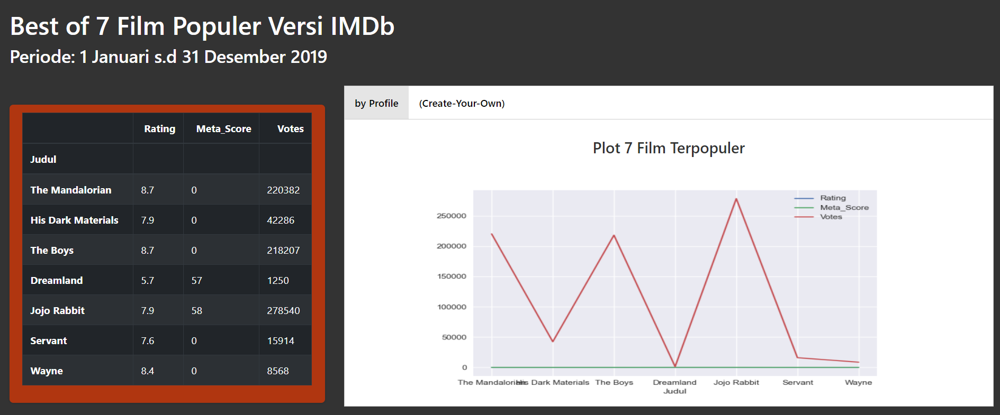

# Web Scraping dengan Menggunakan BeautifulSoup  
Project ini merupakan implementasi web scraping dengan menggunakan `Python` dengan memanfaatkan library `BeautifulShop`. Case yang akan dibahas pada project ini adalah bagaimana mengambil data dari situs IMDb (Internet Movie Database). 
IMDb (Internet Movie Database) adalah sebuah basis data daring informasi yang berkaitan dengan film, acara televisi, video rumahan, dan permainan video, dan acara internet, termasuk daftar pemeran, biografi kru produksi dan personil, ringkasan alur cerita, trivia, dan ulasan serta penilaian oleh penggemar. 
Pada project Capstone antara lain berisi: 
1. pengumpulan data dan informasi pada situs IMDb dengan mengimplementasikan teknik web scrapping menggunakan `BeatufilSoup`
2. Creating Dataframe dan Data Wrangling
2. Data Visualization dengan menganalisa informasi yang didapat yaitu film terpopuler versi IMDB dengan menggunakan `matplotlib` dan `Flask` dashboard.

## Dependency ##
- beautifulSoup4
- pandas
- flask
- matplotlib

atau dapat dengan cara langsung menginstall requirement.txt yang ada pada project ini
> `pip install -r requirements.txt`

## Hasil Scraping ##
Berikut adalah hasil scraping yang telah diubah ke dalam bentuk DataFrames  

## Flask ##
Berikut merupakan hasil tampilan dashboard dengan menggunakan `Flask`   

